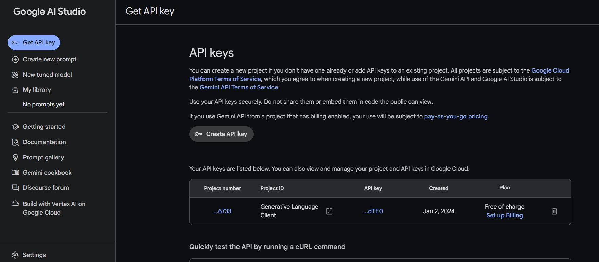

Welcome to Blox AI, where crafting flowcharts and diagrams is a breeze and get an explanation from the top Google Gemini model about your creations! Seamlessly create stunning visuals and rich documentation with our intuitive tools. Collaborate effortlessly with your team, from basic flowcharts to intricate diagrams. Enjoy secure workspaces and easy sharing. Start visualizing your ideas today!

Visit the site here - [Blox AI](https://blox-ai.vercel.app/)

## 🏆 Featured in:

<table>
    <tr>
      <th>Event Logo</th>
      <th>Event Name</th>
      <th>Event Description</th>
    </tr>
    <tr>
        <td></td>
        <td>GirlScript Summer of Code 2024</td>
        <td>GirlScript Summer of Code is a three-month-long Open Source Program conducted every summer by GirlScript Foundation. It is an initiative to bring more beginners to Open-Source Software Development. 
    </tr>
</table>

# Table of Contents

- [Features](#features)
- [Tech Stack](#tech-stack)
- [Authors](#authors)
- [Contributors](#contributors)
- [How to Get API Keys](#how-to-get-api-keys?)
- [Licence](#licence)

## Features

- **Effortless Flowchart and Diagram Creation**: Easily create flowcharts and diagrams with our intuitive tools.
- **Rich Text Editor**: Craft beautiful documentation with our powerful rich text editor.

- **Collaborative Sharing**: Share your creations effortlessly with your entire team.

- **Versatile Visualizations**: From simple flowcharts to complex diagrams, Blox AI covers all your visualization needs.

- **AI Explanation**: Gemini AI visual model integration for explanation of the flowcharts of other diagrams made in the editor

- **Wide Range of Use Cases**: Whether it's wireframes, mind maps, or algorithms, Blox AI has you covered.

- **Secure Workspaces**: Enjoy peace of mind with our secured workspaces for your projects.

- **Limited Files Allotment**: Get a set number of files allotted, ensuring efficient usage of resources.

- **Install as app**: Can also be installed as an app and run smoothly in mobiles anytime

## Tech Stack

- Next.Js 14
- Typescript
- ShadCN UI
- TailwindCSS
- Convex
- Kinde
- EditorJS
- Excalidraw

## Authors

- Subhadeep Roy - [@subhadeeproy3902](https://git.new/Subha)
- Anish Biswas - [@xeven777](https://github.com/Xeven777)

## Contributors

Interested contributors and issue raisers are also requested to join [WhatsApp Group](https://chat.whatsapp.com/E5oRd1VG1Ov4HoNPq4QcRU). For more discussions and faster PR merging

To ensure transparency and recognition for your contributions, we've established a straightforward process. When resolving issues or submitting PRs, please remember to fill out your details in `src/app/contributors/ContributorsData.ts`. This file serves as a repository of the individuals who are actively involved in improving our platform.

Add your Name, Image URL and Github link in this file as an object ->  

However, it's important to adhere to strict regulations to maintain the integrity of our contributor records:

1. Only Add Your Details: You are allowed to add your own details to the ContributorsData.ts file. This helps us accurately attribute contributions to the right individuals.

2. Respect Others' Details: Modifying or tampering with existing contributor details is strictly prohibited. Any unauthorized changes may result in your PR not being merged or accepted.

We understand that open source collaboration is filled with excitement and fulfillment. Your contributions are invaluable, and we're committed to ensuring that your efforts are duly recognized and appreciated.

## How to get the API Keys?

1. Kinde API keys are already provided. Official Docs : [Kinde](https://kinde.com/)
2. Convex API keys are already provided. Official Docs : [Convex](https://www.convex.dev/)
3. For Gemini API keys, visit [Gemini AI Studio](https://aistudio.google.com/app/apikey) and create a new API key. Copy and paste it into the .env file.

## Licence

[MIT](https://github.com/subhadeeproy3902/BloxAI/blob/main/LICENSE)

## 💪 Thanks to all Contributors

Thanks to all contributors for helping this project grow! 🍻

 
## Support 🙏 

Don't forget to leave a star ⭐ for this project!

Crafted with ♥ by @subhadeeproy3902 & @xeven777.

<a href="#top">Back to top</a>

